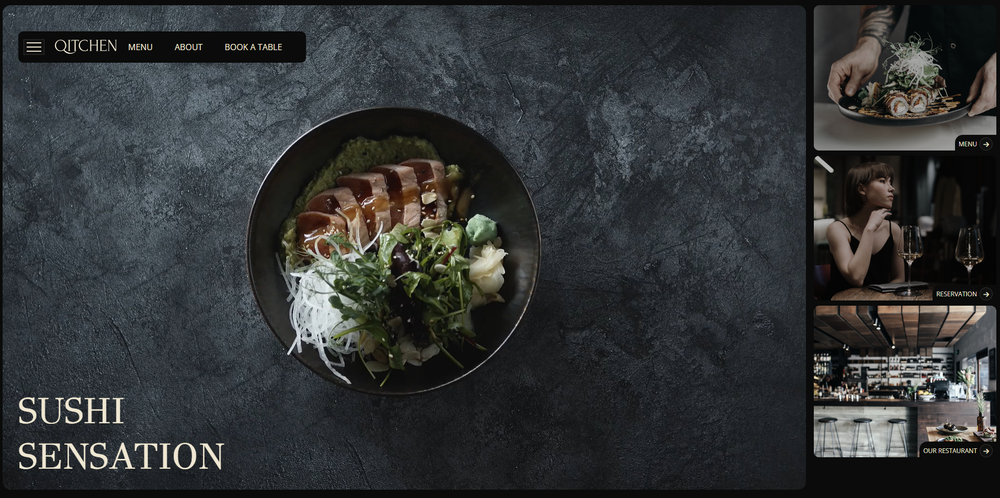

# Qitchen

**Qitchen** is a sleek, static demo for a restaurant-style web experience—incorporating multiple pages such as home, menu, reservation, blog, and contact. Built with HTML, CSS, and vanilla JavaScript, it's perfect for learning or rapid prototyping.

## Table of Contents

- [Demo / Live Preview](#demo--live-preview)  
- [Features](#features)  
- [Technologies Used](#technologies-used)  
- [Project Structure](#project-structure)  
- [Usage Guide](#usage-guide)  
- [Customisation](#customisation)  
- [Contributing](#contributing)  
- [License](#license)

---
## Demo / Live Preview

🌐 Live Demo: [Qitchen on GitHub Pages](https://loai-radwan.github.io/qitchen/)

---

##  Features

- Multi-page static site: Home, Menu, Reservation, Blog, About, Contact  
- Responsive design powered by a custom CSS `style.css`  
- Dynamic or interactive elements managed via `app.js`  
- Placeholder areas for image and video assets (`img/`, `video/`)  
- Clean structure ideal for educational purposes or further enhancement

---

## Technologies Used

- **HTML5** – Structure and markup  
- **CSS3** – Styling and layout (`style.css`)  
- **JavaScript (Vanilla)** – Interactivity and dynamic behaviors (`app.js`)  

---

##  Project Structure

qitchen/
│
├── index.html           # Home page
├── menu.html            # Menu page
├── reservation.html     # Reservation page
├── about.html           # About page
├── blog.html            # Blog page
├── contact.html         # Contact page
│
├── style.css            # Main stylesheet
├── app.js               # JavaScript logic
│
├── img/                 # Images
└── video/               # Videos

---

## Usage Guide

- Home Page: Welcoming intro; perhaps includes site navigation

- Menu Page: Showcase dishes or offerings (could use static markup or JS to load dynamically)

- Reservation Page: Static form or interactive reservation workflow

- Blog Page: Static posts or placeholder for dynamic content

- Contact Page: Form or contact info (email, phone, location)

##  Customisation  

- Update text, images, and videos to fit your brand  
- Modify `style.css` for colors, fonts, and layout changes  
- Enhance `app.js` for more interactivity (e.g., form validation, animations)  

---

##  Contributing  

Contributions are welcome!  

1. Fork the repo  
2. Create a feature branch  
3. Submit a pull request  

---

##  License  

This project is licensed under the **MIT License**.  
Feel free to use and modify for personal or educational purposes.  
